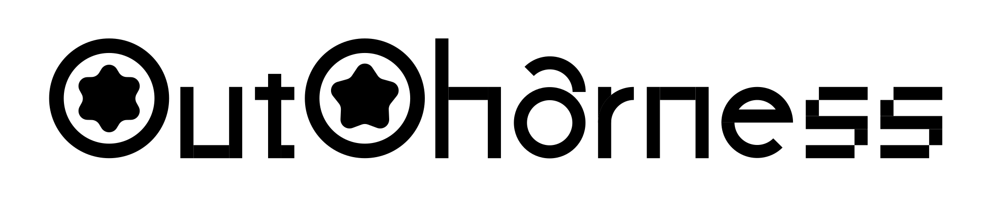

<p align="center">
  
</p>

# outo-harness

Agent harness preset manager for effective harness engineering

[](https://npm.npmjs.com/package/outo-harness)
[](https://opensource.org/licenses/MIT)

## Purpose

Different projects require different agent configurations. A React codebase needs different guidance than a Python data pipeline. A startup's monorepo has different conventions than an open-source library.

outo-harness lets you pre-register harness presets that agents can discover and adapt to their working environment. Rather than configuring agents from scratch for every project, you maintain a library of tested configurations.

outo-harness manages harness presets — reusable starting points that you adapt into your project's AGENT.md, rather than writing from scratch.

## Quick Start

```bash
# Add a harness from GitHub
npx outo-harness add owner/repo

# List installed harnesses
npx outo-harness list

# Update all harnesses
npx outo-harness update
```

## Commands

### add <source>

Clones or downloads a harness, validates its HARNESS.md file, and registers it in `.harness.json`.

```bash
# From GitHub owner/repo format
npx outo-harness add vercel/next.js

# From full GitHub URL
npx outo-harness add https://github.com/vercel/next.js

# From npm package
npx outo-harness add @my-org/my-harness
```

The source can be:
- A GitHub repository in `owner/repo` format
- A full GitHub HTTPS URL
- An npm package name (for harnesses published to npm)

After adding, the harness contents are stored in `~/.agents/harness/<name>/`.

### update

Pulls the latest changes for all registered harnesses and re-validates their HARNESS.md files.

```bash
npx outo-harness update
```

This ensures your local copies stay in sync with their upstream sources.

### list

Displays all installed harnesses with their name, description, and path.

```bash
npx outo-harness list
```

Example output:
```
react-typescript  React + TypeScript best practices  ~/.agents/harness/react-typescript
nextjs-app-router Next.js App Router patterns         ~/.agents/harness/nextjs-app-router
python-data       Python data pipeline conventions   ~/.agents/harness/python-data
```

## HARNESS.md Format

Each harness uses a simple markdown format with YAML frontmatter:

```markdown
---
name: my-harness
description: What this harness configures
---

# Harness Content

Content that guides how to control and manage agents in a project.
```

### Frontmatter Fields

| Field | Required | Description |
|-------|----------|-------------|
| `name` | Yes | Unique identifier for the harness |
| `description` | Yes | One-line summary for `list` output |

### What Goes in a Harness

Harnesses are guidelines for how to control agents. They typically include:
- Behavioral patterns and workflow
- Sub-agent management strategies
- Approval policies and safety constraints
- Project-specific conventions

The exact content depends on the project and team preferences.

## How Agents Use It

When setting up a new project:

1. Check available harnesses: `npx outo-harness list`
2. Read a harness: `cat ~/.agents/harness/<name>/HARNESS.md`
3. Use the harness as a **starting point** for the project's AGENT.md
4. Customize for the project's specific needs

The harness provides a starting point, not a rigid template. Projects adapt it to their specific context.

## Creating Your Own Harness

### Step 1: Plan the Scope

Think about what aspects of agent control you want to standardize.

### Step 2: Create the Directory

```bash
mkdir -p ~/.agents/harness/my-harness
```

### Step 3: Write HARNESS.md

Follow the format above. Start with frontmatter, then write your guidance.

### Step 4: Test It

Run an agent in a project that should use your harness. Refine based on actual behavior.

### Step 5: Share It

Publish your harness so others can benefit:

```bash
# If using a GitHub repo
git init
git add HARNESS.md
git commit -m "Initial harness"
git push origin main

# Then users can add with:
npx outo-harness add your-username/your-repo
```

## Registry Format

Installed harnesses are tracked in `.harness.json` in your home directory:

```json
{
  "harnesses": [
    {
      "name": "tdd-loop",
      "description": "Test-driven development pipeline with red-green-refactor cycle",
      "source": "github:owner/tdd-harness",
      "type": "git",
      "installedAt": "2026-05-13T10:30:00.000Z",
      "harnessPath": "~/.agents/harness/tdd-loop"
    },
    {
      "name": "goal-completion",
      "description": "Repeat until goal is fully complete, verify before reporting done",
      "source": "github:owner/goal-harness",
      "type": "git",
      "installedAt": "2026-05-12T08:15:00.000Z",
      "harnessPath": "~/.agents/harness/goal-completion"
    }
  ]
}
```

## Related Concepts

**AGENTS.md** is the framework-agnostic standard for agent instruction files. outo-harness provides harnesses that agents adapt into their project's AGENTS.md.

**CLAUDE.md** is Anthropic's Claude Code format, functionally equivalent to AGENTS.md but Claude Code-specific.

**Cursor Rules** (`.cursor/rules/`) are Cursor AI's instruction files. A harness can include guidance adapted for Cursor's specific behavior.

**Windsurf Rules** (`.windsurfrules`) are Windsurf AI's equivalent format.

All these formats serve the same purpose: give agents guidance about how to work in a codebase. outo-harness helps you build and maintain the underlying guidance that these files ultimately contain.

## License

MIT
